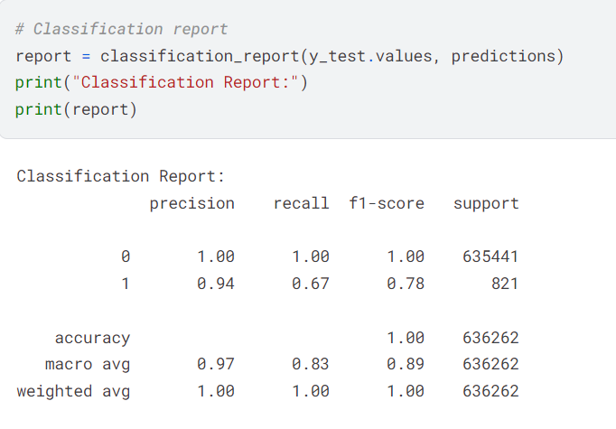
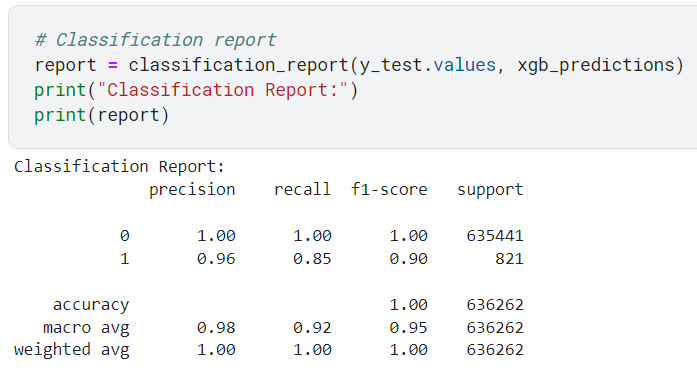

## Overview
This Encrypted Fraud Predictions Application leverages the cryptography library Zama - Concrete-ML to demonstrate the integration of privacy-preserving algorithms into machine learning.

The main web application is built with Next.js, and it uses a simple No-SQL database with Pocketbase. The API server, which hosts the encrypted model, is implemented using FastAPI. It utilizes Concrete-ML for the encrypted model, XGBoost for the plain model, and NumPy and Pandas for data normalization.

## Key Features:

#### - The application can produce predictions with 86% accuracy on encrypted data, compared to the plaintext model which achieves 99% accuracy.
<p float="left">
  
   
</p>
#### - The dataset and the notebook for training both the plaintext and encrypted models are available here: [dataset](https://www.kaggle.com/datasets/k0ala510/fraud-transactions), [notebook](https://www.kaggle.com/code/k0ala510/encryptedxgboost) 

This application showcases the potential of secure and private machine learning, ensuring that sensitive data remains protected while still providing valuable predictive insights. Concrete-ML's encryption capabilities ensure secure data processing, maintaining privacy without significantly compromising accuracy.

Pocketbase provides efficient and flexible data storage, while Next.js offers a robust and modern framework for building the web application. FastAPI ensures a fast and efficient API server capable of handling the encrypted model.

## Usage
To install and use the application, follow these steps:
#### 0. Clone this repository:
```
git clone https://github.com/F1xedbot/Encrypted-Fraud-Detection.git
cd Encrypted-Fraud-Detection
```
#### 1. Deploy the database:
```
./pocketbase serve
```
Import the table schema from the Pocketbase interface. The JSON schema can be found in this repository under the name `pb_schema.json`.


Add your sample data into the database.

#### 2. Deploy the web application:

```
npm install    # Install all dependencies
npm run build  # Build the application
npm run start  # Start the application
```
Verify that your application is running correctly. Initially, it should display all the data fetched from the database.